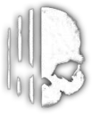

#  PhasmoHelper
A web app to help find ghosts in the game Phasmophobia.

#### https://jobus0.github.io/phasmohelper/

### Features:
- Streamlined interface focused on game-relevant details that are not directly accessible in-game.
- Evidence toggles: Use switches to filter ghosts by evidence, with right-click functionality to cross out options.
- Individual ghost exclusion: Click a ghost's name to rule it out.
- Behavioral toggles: Filter by abnormal ghost behavior, such as early hunts.
- Special filtering for the nightmare difficulty. Highlights guaranteed evidence with dotted borders for clarity.
- Official ghost icons displayed next to ghost names for fast identification.
- Convenient hotkey: Press 'R' to reset evidence selections.
- Extra: Detailed description of cursed possessions.

  